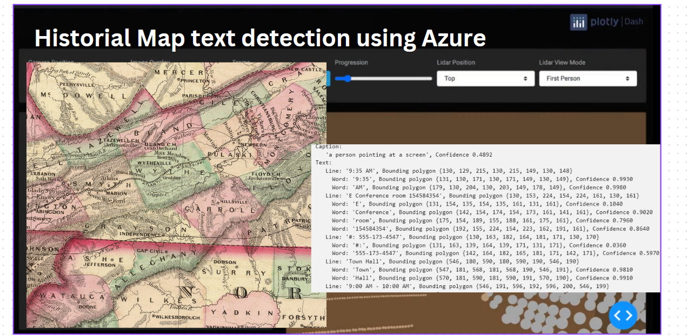

# Historical_map_text_detection
Detecting warped text from historical maps and images with the help of azure AI Vision and Image Analysis services.

## Warped Text Detection from historical maps 
Detecting warped text from historical maps is a complex yet fascinating challenge that holds significant importance for historical research and preservation. These maps often contain crucial geographical, cultural, and socio-political information that has been distorted over time due to aging, environmental factors, and the methods used in their creation.
[Demo Day Registration Slide deck template](https://stdntpartners-my.sharepoint.com/:p:/g/personal/divyansh_goyal_studentambassadors_com/ESB9r3XwlSlBjHpQe9SkhIoBVf38Xonrm7K8TEgPECHMHQ?e=8AhAfA)

## Potential Solution
To address this, we are leveraging Azure AI Cognitive Services and Azure AI Image Analysis to create a robust solution for identifying and interpreting warped text from these historical documents. The project aims to utilize advanced image processing capabilities, including optical character recognition (OCR) and visual feature extraction, to accurately detect and read distorted text.

## Miscellaneous 
--  By analyzing local images with the Image Analysis Client, we can extract valuable information from historical maps, thus preserving historical knowledge and making it accessible for academic research, digital archiving, and educational purposes.
-- This project not only contributes to the preservation of our cultural heritage but also showcases the powerful applications of modern AI technologies in solving historical and document analysis problems.

### Expected End product

## Warped Text Detection from Historical Maps

This project leverages Azure AI Cognitive Services and Azure AI Image Analysis to detect and interpret warped text from historical maps. The key aspects of this project include:

- **Challenge**: Detecting warped text from historical maps is complex due to aging, environmental factors, and the methods used in their creation. These maps contain crucial geographical, cultural, and socio-political information.
- **Solution**: Utilizing Azure AI Cognitive Services and Azure AI Image Analysis, the project aims to create a robust solution for identifying and interpreting warped text.
- **Technologies**:
  - **Image Processing**: Advanced image processing capabilities, including optical character recognition (OCR) and visual feature extraction, are employed to accurately detect and read distorted text.
  - **Local Image Analysis**: By analyzing local images with the Image Analysis Client, valuable information from historical maps can be extracted.
- **Purpose**: 
  - Preserving historical knowledge and making it accessible for academic research, digital archiving, and educational purposes.
  - Showcasing the powerful applications of modern AI technologies in solving historical and document analysis problems.

This project not only contributes to the preservation of our cultural heritage but also highlights the significant capabilities of AI in addressing historical and document analysis challenges.

